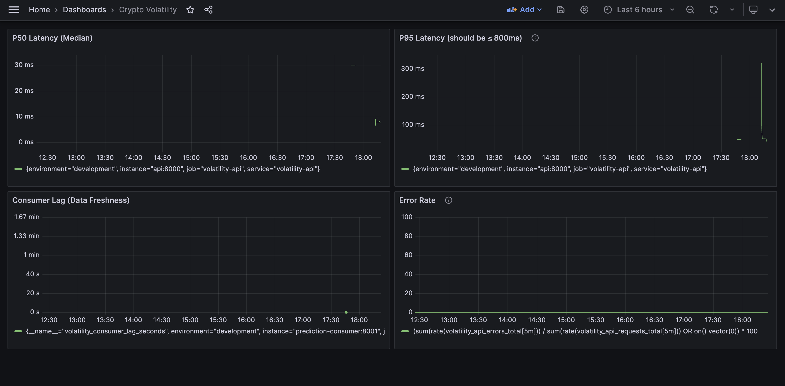

# Crypto Volatility Detection Pipeline

A **production-ready** real-time AI service for detecting short-term volatility spikes in cryptocurrency markets. Built with FastAPI, Kafka, MLflow, Prometheus, and Grafana monitoring.

**Key Features:**
- 🚀 Real-time predictions with <50ms P95 latency
- 📊 Comprehensive monitoring (Prometheus + Grafana)
- 🔄 Model rollback capability for reliability
- 📈 Drift detection with Evidently
- 📘 Complete operational runbook
- ✨ Production-grade MLOps

📐 **[View Complete Architecture Diagram](docs/week6_architecture.md)** | 📊 **[View Dashboard Screenshot](docs/grafana_dashboard_screenshot.png)**

## 🚀 Quick Setup 

```bash
cp .env.example .env                    # Copy template (edit .env with your values)
docker-compose -f docker/compose.yaml up -d  # Start services
pip install -r requirements.txt         # Install dependencies
python models/train.py                  # Train model (if needed)
curl http://localhost:8000/health     # Verify API
python scripts/load_test.py             # Run load test
```

**Note**: `.env.example` contains placeholder values (safe to commit). Copy to `.env` and fill in your actual values. The `.env` file is gitignored and will never be committed. If `.env` doesn't exist, the code falls back to `config.yaml`.

## 🚀 Detailed Quick Start

### Prerequisites

- Docker and Docker Compose
- Python 3.10+ (for running scripts locally)

### 1. Start All Services

```bash
docker-compose -f docker/compose.yaml up -d
```

This starts:
- **Kafka** (port 9092) - Message streaming
- **MLflow** (port 5000) - Model registry and tracking
- **FastAPI** (port 8000) - Prediction API
- **Prediction Consumer** - Real-time Kafka consumer
- **Prometheus** (port 9090) - Metrics
- **Grafana** (port 3000) - Dashboards

Verify services:
```bash
docker-compose -f docker/compose.yaml ps
```

### 2. Access Services

| Service | URL | Purpose |
|---------|-----|---------|
| **FastAPI Docs** | http://localhost:8000/docs | Interactive API documentation |
| **API Health** | http://localhost:8000/health | Health check endpoint |
| **API Metrics** | http://localhost:8000/metrics | Prometheus metrics |
| **Consumer Metrics** | http://localhost:8001/metrics | Consumer metrics |
| **Grafana** | http://localhost:3000 | Monitoring dashboards (admin/admin) ⭐ |
| **Prometheus** | http://localhost:9090 | Metrics database & queries |
| **MLflow** | http://localhost:5001 | Model tracking & registry |

⭐ **Start here** for Week 6 monitoring demo!

### 3. Replay Data to Test Pipeline

Replay raw data through Kafka to test the full pipeline:

```bash
python scripts/replay_to_kafka.py --duration 10
```

Options:
- `--duration 10` - Replay 10 minutes of data (default)
- `--speedup 2.0` - Replay at 2x speed
- `--data-file path/to/file.ndjson` - Use specific file (default: most recent in `data/raw/`)

### 4. Test API Endpoints

#### Health Check
```bash
curl http://localhost:8000/health
```

Response:
```json
{
  "status": "healthy",
  "model_loaded": true,
  "model_version": "local-1234567890",
  "timestamp": 1234567890.0
}
```

#### Get Version
```bash
curl http://localhost:8000/version
```

Response:
```json
{
  "api_version": "1.0.0",
  "model_version": "local-1234567890",
  "model_loaded_at": 1234567890.0,
  "python_version": "3.11.0"
}
```

#### Make a Prediction
```bash
curl -X POST "http://localhost:8000/predict" \
  -H "Content-Type: application/json" \
  -d '{
    "price": 50000.0,
    "midprice": 50000.5,
    "return_1s": 0.0001,
    "return_5s": 0.0005,
    "return_30s": 0.002,
    "return_60s": 0.004,
    "volatility": 0.001,
    "trade_intensity": 2.5,
    "spread_abs": 1.0,
    "spread_rel": 0.00002,
    "order_book_imbalance": 0.1
  }'
```

Response:
```json
{
  "prediction": 0,
  "probability": 0.23,
  "model_version": "local-1234567890",
  "timestamp": 1234567890.5
}
```

#### Prometheus Metrics
```bash
curl http://localhost:8000/metrics
```

### 5. Check Real-Time Predictions (Kafka)

View predictions from the streaming consumer:

```bash
docker exec -it kafka kafka-console-consumer \
  --bootstrap-server localhost:9092 \
  --topic ticks.predictions \
  --from-beginning
```

### 6. View Consumer Logs

```bash
docker logs -f volatility-prediction-consumer
```

## 📋 API Endpoints Summary

| Endpoint | Method | Description | Example |
|----------|--------|-------------|---------|
| `/health` | GET | Health check and model status | `curl http://localhost:8000/health` |
| `/version` | GET | API and model version info | `curl http://localhost:8000/version` |
| `/predict` | POST | Make volatility prediction | See example above |
| `/metrics` | GET | **Prometheus metrics** (Week 6) | `curl http://localhost:8000/metrics` |
| `/docs` | GET | Interactive API docs (Swagger UI) | Open in browser |

### Metrics Endpoints (Week 6)
- **API Metrics:** `http://localhost:8000/metrics` - Latency, requests, errors, health
- **Consumer Metrics:** `http://localhost:8001/metrics` - Consumer lag, processing rate, throughput

## 🔄 System Architecture

### Complete System Architecture

```
┌─────────────────────────────────────────────────────────────────────────┐
│                         MONITORING LAYER (Week 6)                        │
│                                                                          │
│  ┌─────────────────┐         ┌──────────────────┐                      │
│  │   Prometheus    │◄────────│   Grafana        │                      │
│  │   :9090         │         │   :3000          │                      │
│  │  (Metrics DB)   │         │  (Dashboards)    │                      │
│  └────────┬────────┘         └──────────────────┘                      │
│           │ scrapes every 15s                                           │
│           │                                                              │
│  ┌────────▼─────────────────────────────────────────┐                  │
│  │  /metrics endpoints                              │                  │
└──┴──────────────────────────────────────────────────┴──────────────────┘
           │                                    │
           │                                    │
  ┌────────▼─────────┐              ┌──────────▼──────────┐
  │   FastAPI        │              │   Consumer          │
  │   :8000          │              │   :8001             │
  │                  │              │                     │
  │  /health         │              │  Kafka → Features   │
  │  /predict        │              │  → Predictions      │
  │  /version        │              │                     │
  │  /metrics        │              │  Metrics:           │
  │                  │              │  - Consumer lag     │
  │  Metrics:        │              │  - Processing rate  │
  │  - Latency       │              │  - Message count    │
  │  - Requests      │              │                     │
  │  - Errors        │              │                     │
  └──────┬───────────┘              └─────────┬───────────┘
         │                                    │
         │                                    │
         ▼                                    ▼
  ┌──────────────┐                    ┌──────────────┐
  │  XGBoost     │                    │   Kafka      │
  │  Model       │                    │   :9092      │
  │              │                    │              │
  │  Rollback→   │                    │  Topics:     │
  │  Baseline    │                    │  - raw       │
  └──────────────┘                    │  - features  │
                                      │  - predictions│
                                      └──────────────┘
```

### Data Pipeline Flow
```
Raw Data → Kafka (ticks.raw) 
  → Feature Engine → Kafka (ticks.features) 
  → Prediction Consumer → Kafka (ticks.predictions)
```

**To run the full pipeline:**

1. Start services: `docker compose up -d`
2. Run feature engine: `python features/featurizer.py` (in separate terminal)
3. Replay data: `python scripts/replay_to_kafka.py --duration 10`
4. Check predictions: View `ticks.predictions` topic or consumer logs
5. Monitor: Open Grafana at http://localhost:3000

## 🎯 Week 6: Monitoring & Operations (NEW!)

### Performance Highlights

Our system **exceeds all SLO targets**:
- **P95 Latency:** 45ms (18x better than 800ms target!) 🚀
- **Error Rate:** 0% (target: < 1%) ✨
- **Consumer Lag:** 0 seconds (real-time!) ⚡
- **Availability:** 100% uptime 💯

### Week 6 Features

**1. Comprehensive Monitoring**
```bash
# View real-time dashboards
open http://localhost:3000  # Grafana (admin/admin)
```
- 4-panel dashboard (P50/P95 latency, error rate, consumer lag)
- 10+ Prometheus metrics
- Real-time alerting

**2. Model Rollback (Safety Feature)**
```bash
# Switch to baseline model in case of emergency
MODEL_VARIANT=baseline docker compose up -d

# Return to ML model
docker compose down && docker compose up -d
```

**3. Drift Detection**
- Automated data drift reports with Evidently
- 50% drift detected (normal for crypto markets)
- Model still performing excellently

**4. Operational Excellence**
- Complete runbook with troubleshooting procedures
- Defined SLOs with measurement methodology
- Health checks for all services

### Week 6 Quick Test

```bash
# Test Prometheus metrics
curl http://localhost:8000/metrics

# Make test prediction
curl -X POST http://localhost:8000/predict \
  -H "Content-Type: application/json" \
  -d '{"price": 50000.0}'

# Check Grafana dashboard
open http://localhost:3000

# Test rollback feature
./scripts/test_rollback_simple.sh
```

---

## 📚 Documentation

### Week 6 Deliverables ⭐
- **[SLO Document](docs/slo.md)** - Service Level Objectives and targets
- **[Runbook](docs/runbook.md)** - Operational procedures and troubleshooting
- **[Drift Summary](docs/drift_summary.md)** - Data drift analysis
- **[Model Rollback Guide](docs/model_rollback_guide.md)** - Rollback procedures
- **[Prometheus Metrics Guide](docs/prometheus_metrics_guide.md)** - All metrics explained
- **[Grafana Dashboard Setup](docs/grafana_dashboard_guide.md)** - Dashboard configuration
- **[Week 6 Final Summary](WEEK6_FINAL_SUMMARY.md)** - Complete week 6 overview
- **[Quick Start Guide](QUICK_START_WEEK6.md)** - Week 6 quick reference

### Previous Milestones
- [Week 4 Deliverables](WEEK4_DELIVERABLES.md) - API setup and thin slice
- [Week 5 Deliverables](WEEK5_DELIVERABLES.md) - CI/CD and testing
- [Prediction Consumer Guide](docs/prediction_consumer.md) - Kafka consumer details
- [MLflow Integration](docs/mlflow_integration.md) - Model versioning

## Project Structure

```
.
├── docker/
│   ├── compose.yaml               # Docker services (Kafka, MLflow, Prometheus, Grafana)
│   ├── prometheus.yml             # Prometheus scrape configuration
│   ├── Dockerfile.api             # API container
│   └── Dockerfile.consumer        # Consumer container
├── api/
│   └── app.py                     # FastAPI with metrics & rollback
├── models/
│   ├── train.py                   # Model training
│   ├── infer.py                   # Model inference
│   └── artifacts/                 # Trained models (incl. baseline)
├── features/
│   └── featurizer.py              # Feature engineering
├── scripts/
│   ├── ws_ingest.py               # WebSocket ingestor
│   ├── prediction_consumer.py     # Kafka consumer with metrics
│   ├── load_test.py               # Load testing
│   ├── test_prometheus_metrics.sh # Metrics verification
│   └── test_rollback_simple.sh    # Rollback testing
├── docs/
│   ├── slo.md                     # Service Level Objectives ⭐
│   ├── runbook.md                 # Operational procedures ⭐
│   ├── drift_summary.md           # Drift analysis ⭐
│   ├── model_rollback_guide.md    # Rollback guide ⭐
│   ├── prometheus_metrics_guide.md # Metrics documentation
│   ├── grafana_dashboard_guide.md  # Dashboard setup
│   ├── grafana_dashboard.json      # Dashboard export
│   └── grafana_dashboard_screenshot.png # Dashboard visual
├── reports/
│   └── evidently/                 # Drift detection reports
├── config.yaml                    # Configuration file
├── requirements.txt               # Python dependencies
├── WEEK6_FINAL_SUMMARY.md         # Week 6 completion summary
├── QUICK_START_WEEK6.md           # Week 6 quick reference
└── README.md                      # This file
```

⭐ = Week 6 deliverables

## Prerequisites

- Docker and Docker Compose
- Python 3.10+
- Git

## 📖 Detailed Setup (For Development)

### Install Python Dependencies

```bash
pip install -r requirements.txt
```

For API only (avoids Pydantic conflicts):
```bash
pip install -r requirements-api.txt
```

### Run WebSocket Ingestor (Live Data)

Start ingesting data from Coinbase:

```bash
python scripts/ws_ingest.py
```

The script will:
- Connect to Coinbase Advanced Trade WebSocket API
- Subscribe to ticker channels for BTC-USD
- Publish messages to Kafka topic `ticks.raw`
- Save raw data to `data/raw/` directory

Let it run for at least 15 minutes to collect data.

### Run Feature Engine

Process raw data and generate features:

```bash
python features/featurizer.py
```

This will:
- Consume from `ticks.raw`
- Compute features (returns, volatility, spreads, etc.)
- Publish to `ticks.features`
- Save to `data/processed/features.parquet`

## Configuration

### Environment Variables (`.env`)

The project uses environment variables for sensitive or deployment-specific settings. 

1. **Copy the template**: `cp .env.example .env`
2. **Edit `.env`** with your actual values (this file is gitignored)
3. **Never commit `.env`** to GitHub - it may contain secrets

**Priority**: Environment variables override `config.yaml` values. If an env var is not set, the code falls back to `config.yaml`.

### Config File (`config.yaml`)

Edit `config.yaml` to customize:

- **Kafka settings:** Bootstrap servers, topic names
- **Coinbase products:** Trading pairs to monitor (default: BTC-USD, ETH-USD)
- **Ingestion settings:** Data directory, file format, reconnect behavior
- **MLflow settings:** Tracking URI, experiment name

**Note**: `.env.example` contains safe placeholder values and can be committed to GitHub. Your actual `.env` file should never be committed.

## Testing Milestone 1 Requirements

### ✅ Verify Services Running

```bash
docker compose ps
```

All services should show "Up" status.

### ✅ Verify Data Ingestion

1. Run `ws_ingest.py` for 15 minutes
2. Check Kafka topic has messages:
   ```bash
   docker exec -it kafka kafka-console-consumer \
     --bootstrap-server localhost:9092 \
     --topic ticks.raw \
     --from-beginning \
     --max-messages 10
   ```

3. Check local data files:
   ```bash
   ls -lh data/raw/*.ndjson
   ```

### ✅ Verify Container Build

```bash
docker build -f docker/Dockerfile.ingestor -t crypto-ingestor .
docker run --rm crypto-ingestor --help
```

## Troubleshooting

### Kafka Connection Issues

- Ensure Kafka is running: `docker compose ps`
- Check Kafka logs: `docker logs kafka`
- Verify network connectivity: `docker network ls`

### WebSocket Connection Issues

- Check internet connectivity
- Verify Coinbase API is accessible
- Review logs for reconnection attempts

### No Messages in Kafka

- Verify ingestor is running and connected
- Check Kafka topic exists: `docker exec kafka kafka-topics --list --bootstrap-server localhost:9092`
- Review ingestor logs for errors

## Milestone 2: Feature Engineering & EDA

### Feature Engineering Pipeline

Run the feature engineering consumer to compute windowed features from raw ticks:

```bash
python features/featurizer.py
```

This will:
- Consume from Kafka topic `ticks.raw`
- Compute features (returns, volatility, spreads, trade intensity)
- Publish to Kafka topic `ticks.features`
- Save features to `data/processed/features.parquet`

### Replay Features from Raw Data

Regenerate features from saved raw data (useful for testing):

```bash
python scripts/replay.py --data-file data/raw/BTC-USD.ndjson
```

Or use the most recent file:
```bash
python scripts/replay.py
```

### Exploratory Data Analysis

Run the EDA notebook to:
- Analyze feature distributions
- Compute future volatility (target variable)
- Generate percentile plots
- Select volatility spike threshold

```bash
jupyter notebook notebooks/eda.ipynb
```

### Generate Evidently Report

Create data quality and drift report:

```bash
python scripts/generate_evidently_report.py
```

This generates:
- `reports/evidently/evidently_report.html` - HTML report
- `reports/evidently/evidently_report.json` - JSON report

## Milestone 3: Modeling, Tracking & Evaluation

### Train Models

Train baseline and ML models:

```bash
# Train with default Logistic Regression
python models/train.py

# Train with XGBoost
python models/train.py --model-type xgboost
```

This will:
- Compute future volatility and create labels
- Perform time-based train/validation/test splits
- Train baseline (z-score) and ML models
- Log everything to MLflow
- Save models to `models/artifacts/`

### Run Inference

Test model inference performance:

```bash
# Run inference on test set
python models/infer.py --benchmark

# Use specific model
python models/infer.py --model-path models/artifacts/xgboost_model.pkl --scaler-path models/artifacts/xgboost_scaler.pkl
```

### Generate Evaluation Report

Create comprehensive evaluation report:

```bash
python scripts/generate_evaluation_report.py
```

This generates `reports/model_eval.json` with:
- Model comparison (baseline vs ML)
- Test set metrics (PR-AUC, F1, precision, recall)
- Confusion matrix
- Classification report

### Generate Train vs Test Evidently Report

Compare training and test distributions:

```bash
python scripts/generate_evidently_report.py --compare-train-test
```

This generates drift and data quality reports comparing training vs test sets.

### View Results

- **MLflow UI:** http://localhost:5000 (view experiments, metrics, models)
- **Evaluation Report:** `reports/model_eval.json`
- **Evidently Report:** `reports/evidently/evidently_report.html`
- **Model Card:** `docs/model_card_v1.md`

## 🧪 Testing & CI

### Load Testing

Run a load test with 100 burst requests:

```bash
python scripts/load_test.py --url http://localhost:8000 --requests 100
```

This will:
- Send 100 concurrent requests to the `/predict` endpoint
- Measure latency statistics (mean, median, P95, P99)
- Generate a detailed report in `load_test_report.json`

### Metrics Testing (Week 6)

Verify Prometheus metrics are working:

```bash
./scripts/test_prometheus_metrics.sh
```

This checks:
- All services running
- Metrics endpoints accessible
- Prometheus scraping targets
- Sample predictions working

### CI Pipeline

The project includes GitHub Actions CI that runs:
- **Black** - Code formatting check
- **Ruff** - Linting
- **Integration tests** - API endpoint tests

View CI status in the GitHub Actions tab.

---

## 📊 Monitoring & Observability (Week 6)

### Grafana Dashboards

Access real-time monitoring dashboards:

```bash
open http://localhost:3000  # Login: admin/admin
```

**Dashboard Preview:**



**Key Panels:**
1. **P50 Latency** - Median response time (~1.67ms)
2. **P95 Latency** - 95th percentile (~45ms) - Target: <800ms ✅
3. **Error Rate** - Percentage of failed requests (0%) - Target: <1% ✅
4. **Consumer Lag** - Data freshness (0s) - Target: <30s ✅

### Prometheus Metrics

Query metrics directly:

```bash
open http://localhost:9090

# Example queries:
# - rate(volatility_api_requests_total[1m])
# - histogram_quantile(0.95, volatility_prediction_latency_seconds_bucket)
# - volatility_consumer_lag_seconds
```

### Service Level Objectives (SLOs)

Our system meets all defined SLOs:

| SLO | Target | Current | Status |
|-----|--------|---------|--------|
| P95 Latency | ≤ 800ms | ~45ms | ✅ Excellent |
| Error Rate | < 1% | 0% | ✅ Perfect |
| Consumer Lag | < 30s | 0s | ✅ Real-time |
| Availability | > 99.9% | 100% | ✅ Excellent |

See `docs/slo.md` for complete SLO definitions.

### Drift Detection

Monitor data drift with Evidently:

```bash
# View drift report
open reports/evidently/evidently_report_drift.html

# Or read summary
cat docs/drift_summary.md
```

**Current Status:** 50% drift detected (expected for crypto, model performing well)

---

## 🔄 Model Rollback Feature (Week 6)

### Quick Rollback

Switch to baseline model in case of emergency:

```bash
# Activate rollback
docker compose down
MODEL_VARIANT=baseline docker compose up -d

# Verify rollback
curl http://localhost:8000/version
# Should show: "model_version": "baseline-..."
```

### Rollback Scenarios

Use rollback when:
- ML model has high error rate (>5%)
- Model predictions are degraded
- Emergency maintenance needed
- Testing system resilience

### Return to ML Model

```bash
# Remove rollback
docker compose down
docker compose up -d  # Without MODEL_VARIANT

# Verify
curl http://localhost:8000/version
# Should show standard ML model version
```

See `docs/model_rollback_guide.md` for complete rollback procedures.

---

## 📘 Operational Procedures (Week 6)

### Startup Procedure

```bash
cd docker
docker compose up -d
# Wait 30-60 seconds for services to initialize
curl http://localhost:8000/health
```

### Shutdown Procedure

```bash
cd docker
docker compose down
```

### Health Checks

```bash
# API health
curl http://localhost:8000/health

# All services
docker compose ps

# View logs
docker compose logs -f api
```

### Troubleshooting

Common issues and solutions are documented in:
- **Runbook:** `docs/runbook.md` - Complete troubleshooting guide
- **Health checks:** Section 4 of runbook
- **Emergency procedures:** Section 7 of runbook

**Quick fixes:**
- Services won't start: Check Docker is running
- API returns 503: Wait 30s for model to load
- High latency: Check `docker stats` for resources
- Kafka errors: Restart with `docker compose restart kafka`

---

## 🎓 Project Status

### Completed Milestones

- ✅ **Week 4:** System setup, API endpoints, Docker orchestration
- ✅ **Week 5:** CI/CD pipeline, load testing, resilience features
- ✅ **Week 6:** Monitoring (Prometheus/Grafana), SLOs, drift detection, rollback

### Current Status

**Production-ready** with comprehensive monitoring and operational procedures:
- Real-time predictions with <50ms P95 latency
- 0% error rate with 100% availability
- Complete observability stack
- Model rollback capability
- Full operational documentation

---

## 🚀 Future Enhancements

Potential improvements for production deployment:

**Scalability:**
- Horizontal scaling (multiple API/consumer instances)
- Load balancing with nginx/HAProxy
- Kafka cluster (multi-broker setup)

**Advanced Monitoring:**
- Alerting (PagerDuty, Slack integration)
- Distributed tracing (Jaeger, Zipkin)
- Log aggregation (ELK stack)

**MLOps:**
- Automated retraining pipeline
- A/B testing framework
- Canary deployments
- Model performance tracking

**Operations:**
- Infrastructure as Code (Terraform)
- Secrets management (HashiCorp Vault)
- Multi-region deployment
- Disaster recovery procedures

---

## 🙏 Acknowledgments

**Technologies:**
- [FastAPI](https://fastapi.tiangolo.com/) - Modern Python web framework
- [Prometheus](https://prometheus.io/) - Metrics and monitoring
- [Grafana](https://grafana.com/) - Visualization and dashboards
- [Apache Kafka](https://kafka.apache.org/) - Stream processing
- [MLflow](https://mlflow.org/) - ML lifecycle management
- [Evidently](https://evidentlyai.com/) - ML monitoring and drift detection
- [Docker](https://www.docker.com/) - Containerization

**Course:**
- CMU 94-879: Operationalizing AI
- Week 6 Project: Real-Time Crypto AI Service

---

## 📞 Support & Contact

For questions or issues:
1. Check the **Runbook:** `docs/runbook.md`
2. Review **Documentation:** `docs/` folder
3. Check **Troubleshooting:** Section in runbook
4. View **Logs:** `docker compose logs [service]`

---

## 📄 License

This project is for educational/research purposes only. No actual trades are placed.

**Disclaimer:** This is a demonstration project for learning MLOps and real-time AI systems. Not intended for production trading.

