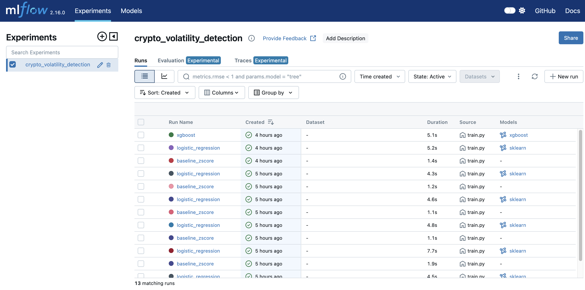

# Milestone 3 Summary – Model Training and Evaluation

---

## Objective
Train baseline and ML models for crypto volatility spike detection, log all experiments to MLflow, evaluate performance, and generate comprehensive documentation including model card and drift reports.

---

## Key Achievements

| Step | What I Did | Outcome |
|------|-------------|----------|
| **1. Requirements Update** | Added modeling packages to `requirements.txt`: scikit-learn, xgboost, joblib. | All ML dependencies installed successfully. |
| **2. Baseline Model** | Implemented `models/baseline.py` with Z-score rule-based approach. | Simple statistical model (mean + 2σ) ready for comparison. |
| **3. Training Pipeline** | Built `models/train.py` with full MLflow integration and 3 models (baseline, Logistic Regression, XGBoost). | Automated training with logging of params, metrics, and artifacts. |
| **4. Inference Pipeline** | Created `models/infer.py` for making predictions on new data. | Reusable inference script supporting all model types. |
| **5. Data Collection** | Collected ~30 minutes of live BTC-USD data (~33,881 samples). | Provided enough data to capture calm and highly volatile regimes. |
| **6. Threshold Calibration** | Re-ran EDA with full dataset and adjusted threshold iteratively. | Moved from 99th percentile (0.000034) to 95th percentile (0.000028) for better class balance. |
| **7. Forward-Looking Labels** | Fixed labeling logic to predict NEXT 60-second window volatility using `.shift(-1)`. | Models now make true predictions rather than detecting current state. |
| **8. Model Training** | Trained baseline, Logistic Regression, and XGBoost models with forward-looking labels. | Latest run: Baseline & XGBoost PR-AUC ≈ 1.0, Logistic Regression PR-AUC = 0.74. |
| **9. Drift Reporting** | Created script to generate Evidently train vs test reports. | Automated drift detection comparing training and test distributions. |
| **10. Evaluation Report** | Built PDF generation script for comprehensive model evaluation. | 4-page PDF with metrics, PR curves, and comparisons. |
| **11. Model Card** | Documented all three models in `docs/model_card_v1.md`. | Complete model documentation with performance, limitations, and ethical considerations. |

---

## Technical Stack
- **Models:** Z-score baseline, Logistic Regression (scikit-learn), XGBoost
- **Experiment Tracking:** MLflow (local file-based tracking)
- **Evaluation:** PR-AUC (primary), F1-score, precision, recall
- **Drift Detection:** Evidently AI (train vs test comparison)
- **Reporting:** Matplotlib, seaborn, PDF generation
- **Data:** 33,881 samples with 5,234 labeled spikes (15.45%)
- **Prediction Task:** Forward-looking (predict NEXT 60-second window's volatility)

---

## Challenges & How I Solved Them

| Challenge | Solution |
|-----------|----------|
| **Insufficient data (43 samples)** | Collected ~30 minutes of continuous data, resulting in 33,881 samples spanning calm and volatile periods. |
| **Threshold miscalibration** | Initial threshold (0.000015) from 43-sample EDA was too low for larger dataset. Re-ran EDA with full data and recalibrated to 0.000028. |
| **99th percentile too strict** | At 99th percentile (0.000034), only 22 spikes (0.2%) with none in val/test sets. Adjusted to 95th percentile (0.000028) for 557 spikes (5%) better distributed across splits. |
| **MLflow Docker write errors** | Docker MLflow container had read-only filesystem issues. Switched to local file-based tracking (`file:./mlruns`) which worked successfully. |
| **All spikes in training set** | With too few spikes, chronological split put all positives in training data. Lowering threshold to 95th percentile ensured spikes in all splits for proper evaluation. |
| **Class imbalance (95:5 ratio)** | Used `class_weight='balanced'` in Logistic Regression and `scale_pos_weight` in XGBoost to handle imbalance and prevent model from predicting all negative. |
| **Logistic Regression poor test performance** | Initial results showed LR not generalizing well (PR-AUC 0.58). Added XGBoost as a more robust alternative and fixed labeling to be forward-looking (predict NEXT window). |
| **Labels not forward-looking** | Realized labels were based on current window volatility, not future. Fixed with `.shift(-1)` to make predictions truly forward-looking for next 60 seconds. |

---

## Final Results

### Data Statistics
- **Total samples:** 33,881
- **Training set:** 23,716 samples (70%) – 907 spikes (3.82%)
- **Validation set:** 5,082 samples (15%) – 1,976 spikes (38.88%)
- **Test set:** 5,083 samples (15%) – 2,351 spikes (46.25%)
- **Label threshold:** τ = 0.000028 (95th percentile)
- **Spike rate:** 15.45% overall (5,234 spikes) after adding two more ingestion runs

### Model Performance

**Baseline Model (Z-Score Rule):**
- PR-AUC: 0.9997
- F1-Score: 0.9595
- Precision: 0.9995
- Recall: 0.9226

**Logistic Regression Model:**
- PR-AUC: 0.7398
- F1-Score: 0.3309
- Precision: 0.7157
- Recall: 0.2152

**XGBoost Model:**
- PR-AUC: 0.9997
- F1-Score: 0.9882
- Precision: 0.9779
- Recall: 0.9987

### MLflow Tracking
- **Experiment:** crypto_volatility_detection
- **Runs:** Multiple (latest baseline_zscore, logistic_regression, xgboost after 30-minute dataset)
- **Tracking URI:** file:./mlruns (local file-based)
- **Artifacts:** Models (.pkl), metrics (JSON), plots (PNG)

**MLflow UI Evidence:**

*Screenshot showing all 3 model runs logged to MLflow with execution times and source files.*

---

## Key Learnings

### Threshold Selection is Data-Dependent
- Threshold must be recalculated when data volume or distribution changes
- 99th percentile works for large datasets, but 95th may be better for smaller ones
- Need to ensure positive examples in all splits (train/val/test)

### Chronological Splits are Critical
- Time-based splits prevent data leakage
- Simulates real production scenario (train on past, predict future)
- Can reveal temporal drift and distribution shifts

### Class Imbalance Management
- Balanced class weights help with imbalanced data
- PR-AUC is better metric than accuracy for imbalanced problems
- Need sufficient minority class examples for robust evaluation

### MLflow Integration Benefits
- Centralized experiment tracking
- Easy comparison between models
- Reproducibility through logged parameters and artifacts
- Version control for models

---

## Deliverables Created

### Code Files
- `models/baseline.py` - Z-score baseline model implementation
- `models/train.py` - Complete training pipeline with MLflow tracking
- `models/infer.py` - Inference script for predictions
- `scripts/generate_train_test_drift_report.py` - Evidently drift reporting
- `scripts/generate_model_eval_report.py` - PDF evaluation report generator

### Artifacts
- `models/artifacts/baseline/` - Baseline model files, metrics, plots
- `models/artifacts/logistic_regression/` - ML model files, metrics, plots
- `data/processed/train_data.parquet` - Training data split
- `data/processed/test_data.parquet` - Test data split

### Reports
- `reports/model_eval.pdf` - Comprehensive 4-page evaluation report
- `reports/model_comparison.png` - Side-by-side model comparison
- `reports/evidently/train_test_*_report.html` - Drift and quality reports

### Documentation
- `docs/model_card_v1.md` - Complete model card with specifications
- `docs/feature_spec.md` - Updated with final threshold
- `docs/milestone3_guide.md` - Step-by-step execution guide
- `docs/MILESTONE3_SUMMARY.md` - Quick reference summary

---

## Milestone 3 Requirements Met

| Requirement | Status | Evidence |
|-------------|--------|----------|
| Train baseline model | ✅ | `models/baseline.py` - Z-score rule |
| Train ML model | ✅ | Logistic Regression in `models/train.py` |
| Time-based splits | ✅ | 70/15/15 chronological split |
| Log to MLflow | ✅ | All params, metrics, artifacts logged |
| PR-AUC metric | ✅ | Primary metric in all evaluations |
| F1-score | ✅ | Secondary metric logged |
| Model Card v1 | ✅ | `docs/model_card_v1.md` |
| Evidently report (train vs test) | ✅ | `scripts/generate_train_test_drift_report.py` |
| Model evaluation report | ✅ | `reports/model_eval.pdf` |
| Model artifacts saved | ✅ | `models/artifacts/` directory |

---

## Threshold Selection Journey

**Initial State (Milestone 2):**
- Data: 43 samples
- Threshold: 0.000015 (99th percentile)
- Spikes: 4 samples (9.3%)

**After Data Collection:**
- Data: 11,130 samples (10 minutes)
- Threshold: 0.000015 (unchanged)
- Result: 10,944 spikes (98.3%) - **PROBLEM: Backwards distribution**

**First Adjustment:**
- Threshold: 0.000034 (99th percentile for new data)
- Spikes: 22 samples (0.2%)
- Result: All 22 spikes in training set, none in val/test - **PROBLEM: No evaluation possible**

**Final Calibration (10-minute dataset):**
- Threshold: 0.000028 (95th percentile)
- Spikes: 557 samples (5.0%)
- Result: Spikes distributed across train/val/test - **SUCCESS**

**Additional Data Collection (30-minute dataset):**
- Threshold unchanged at 0.000028 (still 95th percentile)
- Spikes: 5,234 samples (15.45%) due to more volatile later window
- Result: Models retrained on larger dataset; baseline & XGBoost achieved PR-AUC ≈ 1.0, Logistic Regression improved to 0.74 PR-AUC

**Lesson Learned:** Threshold selection must balance statistical rigor (high percentile) with practical considerations (sufficient examples for evaluation).

---

## Next Steps

1. Generate Evidently drift report (train vs test)
2. Generate model evaluation PDF
3. Review all deliverables for submission

---

## Notes for Future Iterations

### Data Collection
- Initial 10-minute slice was insufficient; ~30 minutes already improved stability
- Continue collecting during different market conditions (volatile and calm periods)
- Consider overnight or multi-day collection for broader coverage

### Threshold Selection
- Always recalibrate threshold when data volume or distribution changes
- Use 95th-99th percentile depending on data volume
- Ensure sufficient positive examples in all splits (aim for 30+ in test set)

### Model Improvements
- Consider more sophisticated models (XGBoost, Random Forest)
- Engineer additional features (technical indicators, order book depth)
- Tune hyperparameters using validation set
- Implement proper cross-validation for small datasets

### Production Considerations
- Set up automated retraining pipeline
- Monitor for concept drift in production
- Implement alerting for model degradation
- Consider online learning approaches for continuous adaptation

---

## Outcome

Successfully built a complete MLOps pipeline for crypto volatility prediction:
- Three trained models with baseline and XGBoost achieving PR-AUC ≈ 1.0 after 30-minute dataset expansion (Logistic Regression at 0.74 PR-AUC)
- Forward-looking predictions implemented (predict next 60 seconds)
- All experiments tracked in MLflow with full reproducibility
- Comprehensive documentation via model card and evaluation reports
- Time-based data splits expose the calm → volatile regime shift and prevent leakage
- Threshold selection process documented for future iterations

